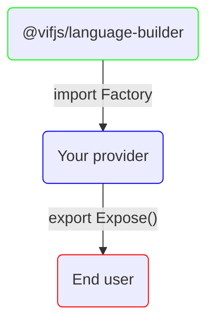

---
outline: deep
---

# Factories

If you plan to create a provider, you need to import all the types you want from @vifjs/language-builder and reexports
them in your package.json.



To facilitate this task, vif provides factory methods for the most complex types.

## Primitives

All primitive types are available at `@vifjs/language-builder/types/primitives`

````ts twoslash
import {
    Bool,
    UInt,
    Int
    // ...
} from '@vifjs/language-builder/types/primitives'
````

### Example with Int

Import the Int type first.

```ts twoslash
import {
    Int as Int_
} from '@vifjs/language-builder/types/primitives'
```

Then, you redefine the `Int` type with your attributes and export it.

You define both the value and the type so Typescript can infer the type properly.

[See more here](https://notes.dt.in.th/TypeScriptValuesAndTypesWithSameName).

```ts twoslash
import {
    Int as Int_
} from '@vifjs/language-builder/types/primitives'

// We create our own interface with our custom attributes
export interface S7 {
    setPoint?: boolean,
    externalAccessible?: boolean,
    externalVisible?: boolean,
    externalWritable?: boolean
}

// ---cut---
export const Int = Int_<S7>
export type Int = Int_<S7>
```

::: details Full code

```ts twoslash
import {
    Int as Int_
} from '@vifjs/language-builder/types/primitives'

export interface S7 {
    setPoint?: boolean,
    externalAccessible?: boolean,
    externalVisible?: boolean,
    externalWritable?: boolean
}

export const Int = Int_<S7>
export type Int = Int_<S7>
```

:::

## Complex types

All complex types have built-in factory functions which starts with `Expose` that allow you to inject your own
attributes.

### Example with Fb

First import the ExposeFb function from @vifjs/language-builder.

```ts twoslash
import {ExposeFb} from "@vifjs/language-builder/pou";
```

Then re-export it.

```ts twoslash
import {ExposeFb} from "@vifjs/language-builder/pou";

export default ExposeFb()

// Or

export const Fb = ExposeFb()
```

To inject your own attributes, use the generic type of any `Expose` function.

```ts twoslash
import {ExposeFb} from "@vifjs/language-builder/pou";

export default ExposeFb<{
    remanent?: boolean
}>()
```