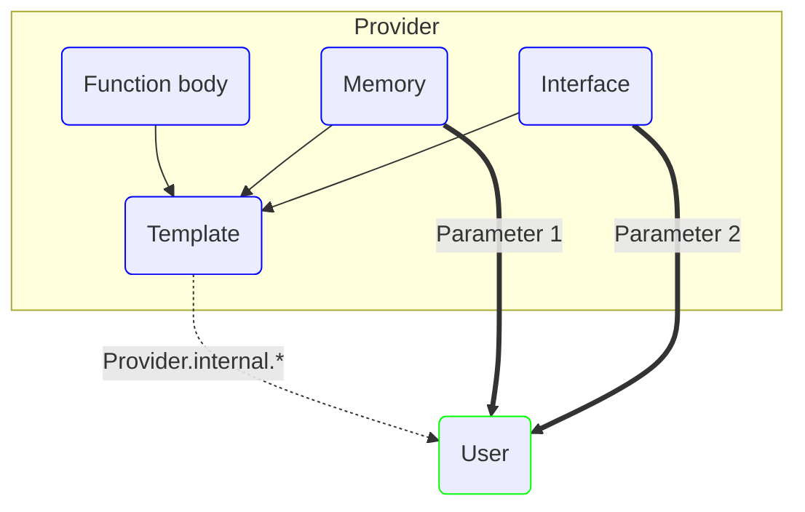

---
outline: deep
---

# Template

::: warning
This type is only available in the language-builder and should not be exposed to the end user.

If you try to use template in a program, [vif-sim](/en/simulation/introduction) will return an error.
:::

## What is a template

`Template` is an advanced type which allow you to create "headless" functions.

Templates only have an interface schema and a reference to a memory location.

To tell vif to reference a variable in the inner memory, you need a special type called `Resolve` which contains the
supposed path of a variable in memory.

On compilation, [vif-sim](/en/simulation/introduction) will check if interface variables & all `Resolve` match a valid memory reference.

You only define the types of the interface and the memory, the end user will have to provide a valid memory reference
and interface.



### Create a template

To create a template, first import Template & Resolve from `@vifjs/language-builder`.

```ts twoslash
import {Resolve, Template} from "@vifjs/language-builder/template";

```

Then create a new class which extends the template.

```ts twoslash
import {Resolve, Template} from "@vifjs/language-builder/template";

```

The `super()` in the constructor must provides the body of your function.

As said earlier, templates have no idea about the the types of your interface.

To implicitly tell Vif these types should be solved later, use the `Resolve` function.

Finally you can create a function with a custom name that merges the interface and the body provided.

### Example with Timer Pulse

#### Inner memory

We first declare the inner memory that a Timer must have, as said earlier this is the function static memory.

For a Timer Pulse, the memory will be an `udt_impl` so we're going to create a new class that extends [Udt](/en/language/pou#Udt)

```ts
// Declare our UDT
export const TPInstance = new Udt({
    IN: new Bool(),
    PT: new Time(),
    Q: new Bool(),
    ET: new Time(),
})
```

Next we will add it to the provider internal so the users can declare a TPInstance.

```ts
export default new Provider(
    {
        // ...
        internal: {
            "TPInstance": TPInstance, // [!code ++]
        }
    }
)
```

:::details How the end user will see this
```ts
import {Provider} from "#source"

const MyFb = new Fb({
    interface: {
        static: {
            Timer: Provider.internal.TPInstance
        }
    }
})
```
:::

#### Template

We will create the template by extending the `Template` class.

The [super()](https://developer.mozilla.org/en-US/docs/Web/JavaScript/Reference/Operators/super) needs a function that returns an array of Operations.

This is the same thing as the `body()` of any POU function block.

```ts
class TP extends Template {
    constructor() {
        super(() => {
            return []
        })
    }
}
```

We need to define the operations, since we're building a Timer we will use a [Timer State Machine](/en/advanced/state-machines).

```ts
class TP extends Template {
    constructor() {
        super(() => {
            return [
                new Timer_State_Machine({ // [!code ++]
                    // Start when IN is true
                    start: new Compare(new Resolve(["#inner", "IN"]), "=", true), // [!code ++]

                    // TP cannot be cancelled until it's elapsed
                    reset: undefined, // [!code ++]
                    preset_var: new Resolve(["#inner", "PT"]), // [!code ++]
                    timer_var: new Resolve(["#inner", "ET"]), // [!code ++]

                    // Q is always true while the timer is on
                    on_timer_start: [new Assign(new Resolve(["#inner", "Q"]), true)], // [!code ++]
                    on_timer_elapsed: [ // [!code ++]
                        new Assign(new Resolve(["#inner", "Q"]), false), // Set Q to false when the timer is stopped // [!code ++]
                        new Internal_Reset(new Resolve(["#inner", "ET"])) // Reset the elapsed time // [!code ++]
                    ], // [!code ++]

                    // No need to have reset operations
                    on_timer_reset: [] // [!code ++]
                }) // [!code ++]
            ]
        })
    }
}
```

Finally we need to provide a function that will build the template an make it available to the end user.

To do this, we need to call the super `build` function of `Template`.

`build` has 2 parameters:
 - **innerMemory**: The memory that the template will use to store data (in our case TPInstance).
 - **callInterface**: The interface the end user must fill to call your template.

You are free to name the function the way you like it.

```ts
class TP extends Template {
    constructor() {
        super(() => {
            // ...
        })
    }

    public useMyGreatTimer( // [!code ++]
        timer_memory: typeof TPInstance, // [!code ++]
        call_interface: { // [!code ++]
            input: { // [!code ++]
                IN: Bool, // [!code ++]
                PT: Time // [!code ++]
            }, // [!code ++]
            output: { // [!code ++]
                Q: Bool, // [!code ++]
                ET: Time // [!code ++]
            } // [!code ++]
        }): Operation<void> { // [!code ++]
        return super.build(timer_memory, call_interface) // [!code ++]
    } // [!code ++]
}
```

:::details How the end user will see this
```ts
import {Provider} from "#source"

const MyFb = new Fb({
    interface: {
        static: {
            Timer: Provider.internal.TPInstance.self(),
            triggerTimer: new Bool(true),
            elaspedTime: new Time(),
            outputTimer: new Bool(),
        }
    },
    body() {
        return [
            Provider.internal.TP.useMyGreatTimer({
                input: {
                    IN: this.static.triggerTimer,
                    PT: Time_from({s: 5}),
                },
                output: {
                    ET: this.static.elaspedTime,
                    Q: this.static.outputTimer,
                }
            })
        ]
    }
})
```
:::