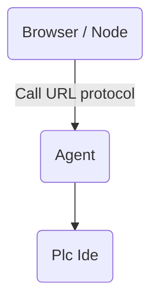

# Agents

Each provider can be associated with an agent that can be launched with a shell command.

An agent is launched using an [URL protocol handler](https://developer.mozilla.org/en-US/docs/Web/API/Navigator/registerProtocolHandler/Web-based_protocol_handlers).

The protocol attempt to launch a program installed on the computer and serve as a bridge between the output of the
provider compiler and a specific plc IDE.

Agents are not installed automatically by [init-vif](/en/install/install) for security reasons, instead you need to
download them manually.

For example, `S7-1200` and `S7-1500` use the "vif-agent-s7" protocol.