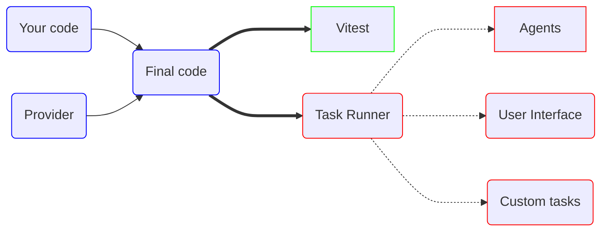

# Architecture

The basic architecture of a freshly started Vif project looks like this: 

To start a new Vif project, go to the [Install](/en/install/install) page.

## Basic usage

### Providers

See [Providers](/en/concept/architecture/providers)

### Task Runner

See [Task Runner](/en/concept/architecture/task-runner)

## Advanced

### Vitest

See [Vitest Integration](/en/simulation/vitest-integration)

### User Interface

See [User Interface](/en/simulation/user-interface)
