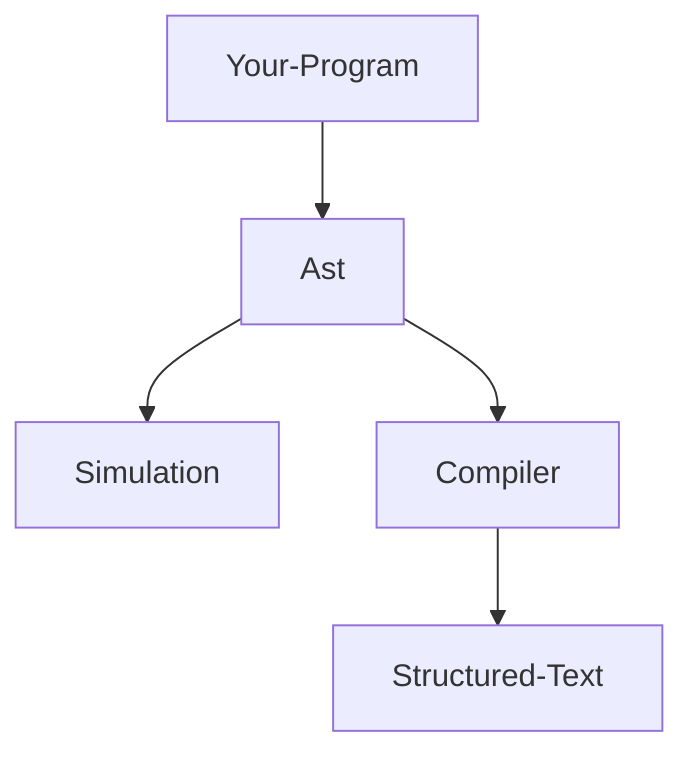

# Protocols

By default Vif compiles into classic IEC structured text.

But it can be enhanced with specific libraries which will change its behavior.

For now, the only target available is S7.

Since the foundations are the same for everyone, the language has a similar syntax from one library to another.

## Steps

Vif always compile with the following steps:



Any program always has an intermediary representation of itself in JSON.

Both simulation & structured text compilation use the same data to work.

For example an assign operation would look like this:

```ts
new Assign(this.static.MyVariable, true)
```

```json
{
  "ty": "asg",
  "src": {
    "assign": {
      "ty": "local",
      "src": {
        "path": ["MyVariable"]
      }
    },
    "to": {
      "ty": "constant",
      "src": {
        "constant": "Bool",
        "value": true
      }
    }
  }
}
```

The idea behind it is to have a human-readable intermediary language which could be easily parsed or modified.

::: info
All types, even operations have an `ast` interface that represents the associated ast schema.
:::

To know more about the ast, check the Advanced features section.

## Structured text

Once we have our ast, Vif has a built-in compiler that transforms the tokens into a Structured text program.

The compiler is an event emitter which calls a dedicated transformer everytime it meets a specific token schema.

If no transformer is present, the compiler will just ignore the tokens.

Pretty much everything necessary to build a valid IEC program is built-in, to know more about how you can can change the
compiler behavior, see the Compiler section of Advanced features.