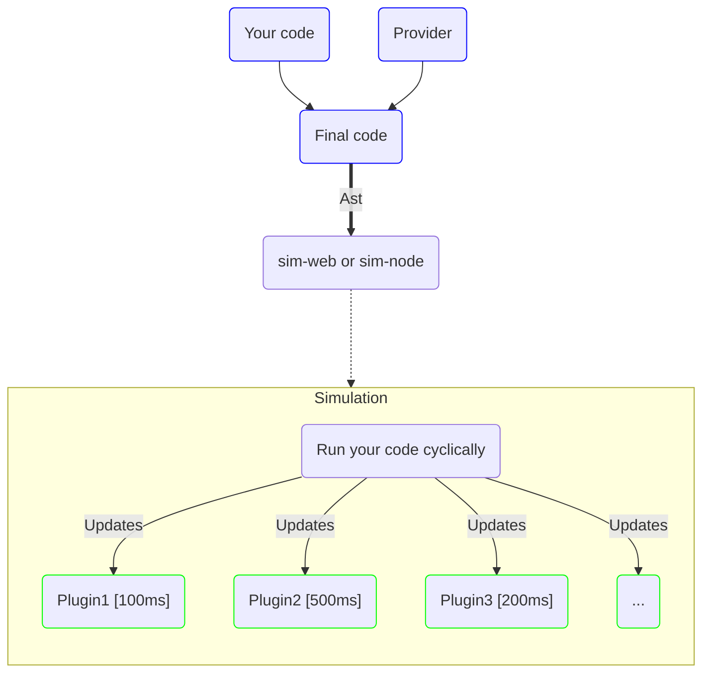

---
outline: deep
---

# Plugins

Plugins are event emitters updated independently from the main container.

[vif-sim](/en/simulation/introduction) has a dispatcher that stores each plugin in a different thread.

Plugins have a name and a refresh interval that can be chosen at their creation.



## Register

To register a plugin, use the `Plugin` class of sim-web / sim-node.

```ts twoslash
import {Plugin} from "@vifjs/sim-node/plugin";

```

A plugin needs a name and a refresh interval (Time in milliseconds).

Once your plugin is registered, you can listen to events.

```ts twoslash
import {Container} from "@vifjs/sim-node/boot";
import {Plugin} from "@vifjs/sim-node/plugin";

const container = new Container()

// ---cut---
const MyPlugin = new Plugin("MyPlugin", 100)
```


## Events

### messages

- **Type**: `string[]`

Displays all recent messages from the last interval.

```ts twoslash
import {Container} from "@vifjs/sim-node/boot"
import {Plugin} from "@vifjs/sim-node/plugin";

const container = new Container()

const MyPlugin = new Plugin("MyPlugin", 100)
// ---cut---

MyPlugin.on("messages", ev => {
    // ...                             
})
```

### warnings

- **Type**: `string[]`

Displays all recent warnings from the last interval.

```ts twoslash
import {Container} from "@vifjs/sim-node/boot"
import {Plugin} from "@vifjs/sim-node/plugin";

const container = new Container()

const MyPlugin = new Plugin("MyPlugin", 100)

// ---cut---
MyPlugin.on("warnings", ev => {
    // ...
})
```

### error

- **Type**: `ParseError`

Non recoverable error, any error is displayed with the following format:

```ts
interface ParseError {
    error: string;
    file_stack: FileTrace[]; // File trace
    sim_stack: string[]; // Steps inside the simulation
}

interface FileTrace {
    file: string;
    column: number;
    line: number;
}
```

```ts twoslash
import {Container} from "@vifjs/sim-node/boot"
import {Plugin} from "@vifjs/sim-node/plugin";

const container = new Container()

const MyPlugin = new Plugin("MyPlugin", 100)
// ---cut---
MyPlugin.on("error", ev => {
    // ...
})
```

### monitor:changes

- **Type**: `MonitorChange[]`

Display all variables changes since the last interval.

```ts
interface MonitorChange {
    id: number;
    value: string;
}
```

```ts twoslash
import {Container} from "@vifjs/sim-node/boot"
import {Plugin} from "@vifjs/sim-node/plugin";

const container = new Container()

const MyPlugin = new Plugin("MyPlugin", 100)
// ---cut---
MyPlugin.on("monitor:changes", ev => {
    // ...
})
```

### breakpoints:statuses

- **Type**: `BreakPointUpdateStatus[]`

Breakpoint status updates.

```ts
interface BreakPointUpdateStatus {
    id: number;
    status: BreakPointStatus;
}

enum BreakPointStatus {
    Inactive = 0,
    Active = 1,
    Disabled = 2,
}
```

```ts twoslash
import {Container} from "@vifjs/sim-node/boot"
import {Plugin} from "@vifjs/sim-node/plugin";

const container = new Container()

const MyPlugin = new Plugin("MyPlugin", 100)
// ---cut---

MyPlugin.on("breakpoints:statuses", ev => {
    // ...
})
```

### unit-tests:statuses

- **Type**: `UnitTestUpdateStatus[]`

Update the status of an unit test.

```ts
interface BreakPointUpdateStatus {
    id: number;
    status: BreakPointStatus;
}

enum BreakPointStatus {
    Inactive = 0,
    Active = 1,
    Disabled = 2,
}
```

```ts twoslash
import {Container} from "@vifjs/sim-node/boot"
import {Plugin} from "@vifjs/sim-node/plugin";

const container = new Container()

const MyPlugin = new Plugin("MyPlugin", 100)

// ---cut---
MyPlugin.on("unit-tests:statuses", ev => {
    // ...
})
```

### monitor:schemas

- **Type**: `MonitorSchema[]`


Get the schemas of the variables that should be monitored.

```ts
interface MonitorSchema {
    path: string[];
    value: {id: number, value: string};
}
```

```ts twoslash
import {Container} from "@vifjs/sim-node/boot"
import {Plugin} from "@vifjs/sim-node/plugin";

const container = new Container()

const MyPlugin = new Plugin("MyPlugin", 100)

// ---cut---
MyPlugin.on("monitor:schemas", ev => {
    // ...
})
```

### breakpoints

- **Type**: `BreakPoint[]`

Get the schemas of the variables which should be monitored.

```ts
interface BreakPoint {
    path: FileTrace | null;
    id: number;
    status: BreakPointStatus;
}

interface BreakPointUpdateStatus {
    id: number;
    status: BreakPointStatus;
}
```

```ts twoslash
import {Container} from "@vifjs/sim-node/boot"
import {Plugin} from "@vifjs/sim-node/plugin";

const container = new Container()

const MyPlugin = new Plugin("MyPlugin", 100)

// ---cut---
MyPlugin.on("breakpoints", ev => {
    // ...
})
```

### unit-tests

- **Type**: `UnitTest[]`

Get the schemas of the variables which should be monitored.

```ts
interface UnitTest {
    description: string;
    id: number;
    status: UnitTestStatus;
}

enum UnitTestStatus {
    Unreached = 0,
    Failed = 1,
    Succeed = 2,
}
```

```ts twoslash
import {Container} from "@vifjs/sim-node/boot"
import {Plugin} from "@vifjs/sim-node/plugin";

const container = new Container()

const MyPlugin = new Plugin("MyPlugin", 100)

// ---cut---
MyPlugin.on("unit-tests", ev => {
    // ...
})
```

### simulation:stack

- **Type**: `Stack[]`

Get the schemas of the variables which should be monitored.

```ts
interface Stack {
    root: Section | null;
    current: Section | null;
}

interface Section {
    name: string;
    ty: string;
    content: VecSectionOrLog;
}

type VecSectionOrLog = SectionOrLog[];

type SectionOrLog = { Log: string } | { Section: Section };
```

```ts twoslash
import {Container} from "@vifjs/sim-node/boot"
import {Plugin} from "@vifjs/sim-node/plugin";

const container = new Container()

const MyPlugin = new Plugin("MyPlugin", 100)

// ---cut---
MyPlugin.on("simulation:stack", ev => {
    // ...
})
```

### simulation:entry-points

- **Type**: `string[]`

Get the schemas of the variables which should be monitored.

```ts twoslash
import {Container} from "@vifjs/sim-node/boot"
import {Plugin} from "@vifjs/sim-node/plugin";

const container = new Container()

const MyPlugin = new Plugin("MyPlugin", 100)

// ---cut---
MyPlugin.on("simulation:entry-points", ev => {
    // ...
})
```

### simulation:status

- **Type**: `SimulationStatus`

Get the schemas of the variables which should be monitored.

```ts twoslash
import {Container} from "@vifjs/sim-node/boot"
import {Plugin} from "@vifjs/sim-node/plugin";

const container = new Container()

const MyPlugin = new Plugin("MyPlugin", 100)
// ---cut---

MyPlugin.on("simulation:status", ev => {
    // ...
})
```

### parse-provider:status

- **Type**: `ParseStatus`

Get the schemas of the variables which should be monitored.

```ts twoslash
import {Container} from "@vifjs/sim-node/boot"
import {Plugin} from "@vifjs/sim-node/plugin";

const container = new Container()

const MyPlugin = new Plugin("MyPlugin", 100)

// ---cut---
MyPlugin.on("parse-provider:status", ev => {
    // ...
})
```

### parse-program:status

- **Type**: `ParseStatus`

Get the schemas of the variables which should be monitored.

```ts twoslash
import {Container} from "@vifjs/sim-node/boot"
import {Plugin} from "@vifjs/sim-node/plugin";

const container = new Container()

const MyPlugin = new Plugin("MyPlugin", 100)

// ---cut---
MyPlugin.on("parse-program:status", ev => {
    // ...
})
```
