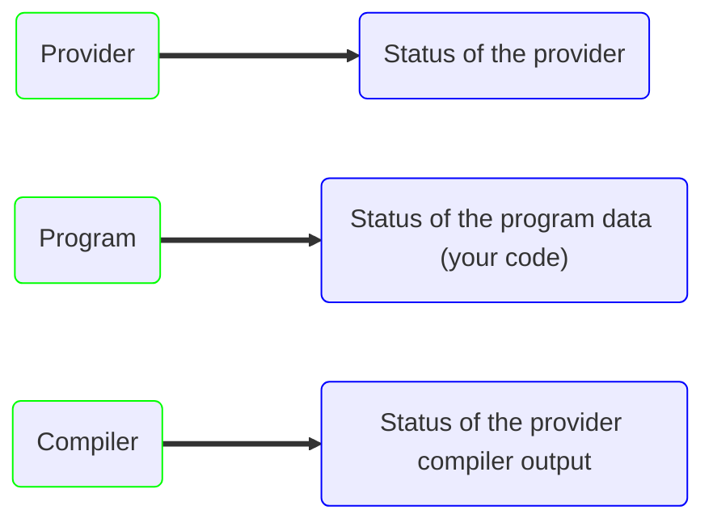

---
outline: deep
---

# User Interface

::: tip
[init-vif](/en/install/install) will install this package automatically using the Ui option.

Just run `npm run main` to see some magic happen.
:::

<a href="https://www.npmjs.com/package/@vifjs/ui" target="_blank" class="flex flex-row gap-2 w-max">
    
    
</a>

```sh [npm]
npm install @vifjs/ui
```

VifUi is a [Nuxt](https://nuxt.com/) App running a graphical interface on top of [vif-sim](/en/simulation/introduction).

It uses the browser version of the simulation and can call an agent (if supported by browser / network configuration).

All the features of [vif-sim](/en/simulation/introduction) are present, from breakpoints to unit-tests and manual commands.

It can also listens for file changes in your IDE and open files locally if traces are present.


## Initialization

To use the ui, you need the [task-runner](/en/concept/architecture/task-runner) installed.

On any task file, import `runUi` from `@vifjs/ui/run`

```js
import { runUi } from "@vifjs/ui/run";
```

Then use an [once](/en/concept/architecture/task-runner#once) callback to launch the ui.

```js
import { StartRunner } from "@vifjs/task-runner/runner";
import { runUi } from "@vifjs/ui/run";

const run = await StartRunner("./code/main.ts");
run.once(runUi({ browser: true }));
```

`runUi` has the following options

 - **baseUrl**: The baseUrl of the task runner, default localhost.
 - **server**: Override the server port instead of the one provided by task-runner.
 - **socket**: Override the socket port instead of the one provided by task-runner.
 - **serverUrl**: Override the server url of the task-runner, regardless of **server**.
 - **socketUrl**: Override the server url of the task-runner, regardless of **socket**.
 - **browser**: Launch the browser automatically when the node server is ready.

## Usage

VifUi is synced with the task-runner and will always fetch the latest state / data of your program.

### Start

The start part at the top left of VifUi always show the file path of where the `exportAsRunnable` was emitted.


#### Config

Config will display the following modal:


The simulation mode lets you change the way the simulation should behave.

See [Container Params](/en/simulation/boot#loadcontainerparams).

#### Export

VifUi can call an agent if the provider has one registered, however it can't check if the agent is installed automatically.

If you are on a local network, you can still paste the address of a running instance in the `URL` field.

#### Download

Download a json file with the provider compiler output inside.

### States

The button group at the top represents the different states of the task-runner




Whenever something went wrong with the task-runner (a syntax error, a VifSim parse error) the specified tab will turn red.

The task-runner states won't interfere with VifUi current status until you click any of the `Load` or `Export` buttons.

:::info
Steps are sequentially dependent on each other, if `Provider` is invalid both `Program` and `Compiler` won't be able to work. 
:::

### Plc

The plc tab is where you control the simulation.


If all states are ok, the correct way to start a new simulation is to follow the next steps:

 - Load the provider by clicking the `Load` next to the provider name.

This step can only be done once, as a provider will never change.

 - Load your program by clicking the `Load` next to `Program`.
 - Select an `Ob` as the entry point of your program.
 - Use the ▶️ button to start the simulation.

When a simulation is over, Vif does not reset all values automatically (will change in a future release).

To load the initial state of your program again, click `Reset` and `Load` again.

